## 悦村居

> appid：wx21d38ae68a0f69e0
>
> 团队成员：栾佳琪、张思敏

### 一、项目说明

#### 1、主题陈述

乡村文化建设是振兴乡村的重要之举，如今，村民们参与文化活动的意识和观念也渐渐发生了变化，广场舞、视频分享生活等方式丰富着他们的业余生活。本项目致力于传播乡村传统文化、广场舞、书法等，并帮助村民们互动起来。此外，本项目提供普法、农技知识等课程，并支持线上教学以帮助村民们更好地学习生活技能、提高生活水平。

### 二、系统需求

#### 1、功能性需求

1. 村民：
   - 村民进入小程序后，可以账号登录、注销；可以签到；
   - 可以浏览最新资讯；
   - 可以查看有关法律法规的图文信息；
   - 可以查看不同类别的所有课程并订阅需要的课程；
   - 可以查看并收听已上传的歌曲；
   - 可以浏览村民们已上传的关于记录生活的图文信息；
   - 可以观看村民们已上传的有关生活等的视频，并且可以为喜欢的视频点赞；
   - 可以查看已订阅课程的课程详情，包括课程简介、视频资源、图文资源等，并可以在线查看课程视频或图文资源；
   - 可以查看已订阅课程的问答情况，可以发表自己的问题或解答；
   - 可以查看已订阅课程的发布的作业，并可以在线查看作业相关文档、上传作业（图片、表格、文档等）；
   - 可以在已订阅课程的群聊中与同学老师交流，可以在线视频聊天、发送语音消息；
   - 可以接收已订阅课程的通知并查看详情；
   - 可以与已订阅课程的老师单独聊天，可以语音、视频聊天；
   - 可以对小程序进行反馈。
2. 管理人员：可以登录、注销；可对平台内相关内容进行管理，包括增、删、查询等操作

#### 2、非功能性性需求

1. 安全性：云数据库上的数据每周备份一次，保留备份记录，备份数据在其他设备上存储。  
2. 灵活性：可根据用户和市场的需求，不断升级更新。 
3. 可维护性：具备改正性维护、适应性维护、扩充与完善性维护等。 
4. 可靠性：存储的数据不会轻易丢失，系统不会因为正常的用户访问流量过大而导致瘫痪。 
5. 可测试性：在微信开发者工具中，允许对不同设备进行测试调配，允许对软件系统的不同功能进行测试调配。 
6. 易用性：所有类型的人员无需经过复杂的专业培训，小程序使用方便，上手操作快捷。

### 三、功能需求规范

#### 1、利益相关者

1. 村民
2. 管理人员

#### 2、行动者和目标

1. 行动者1:村民

   目标：

   1. 能够账号登录、注销；可以签到；
   2. 能够浏览最新资讯；
   3. 能够查看有关法律法规的图文信息；
   4. 能够查看不同类别的所有课程并订阅需要的课程；
   5. 能够查看并收听村民们已上传的歌曲；
   6. 能够浏览村民们已上传的关于记录生活的图文信息；
   7. 能够观看村民们已上传的有关生活等的视频，并且可以为喜欢的视频点赞；
   8. 能够查看已订阅课程的课程详情，包括课程简介、视频资源、图文资源等，并可以在线查看课程视频或图文资源；
   9. 能够查看已订阅课程的问答情况，可以发表自己的问题或解答；
   10. 能够查看已订阅课程的发布的作业，并可以在线查看作业相关文档、上传作业（图片、表格、文档等）；
   11. 能够在已订阅课程的群聊中与同学老师交流，可以在线视频聊天、发送语音消息；
   12. 能够接收已订阅课程的通知并查看详情；
   13. 能够与已订阅课程的老师单独聊天，可以语音、视频聊天；
   14. 能够对小程序进行反馈。

2. 行动者2:管理人员

   目标：

   1. 能够账号密码登录管理端界面，用于权限限制
   2. 能够更新最新资讯的图文信息，包括增加和删除。

#### 3、用例和描述

1. ##### 村民

   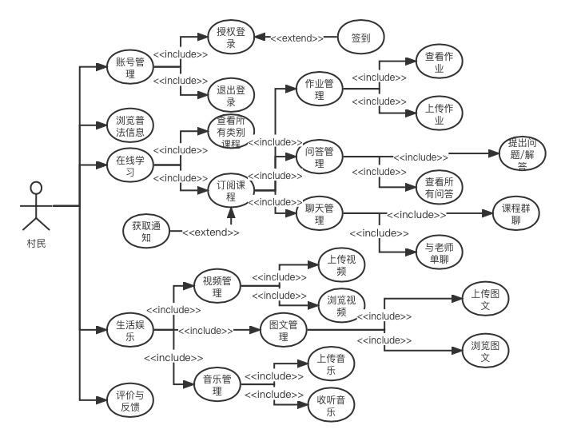

   

2. 管理人员

   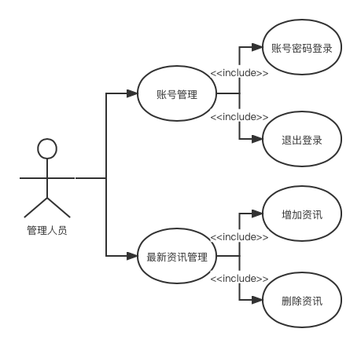

### 四、系统架构设计与实现

#### 1、架构样式

以数据为中心的体系结构，不同的页面间独立运行，数据库的增删改查可以在多个页面实现，在更改现有页面或增加新页面时，不会影响其他页面，促进了可集成性。

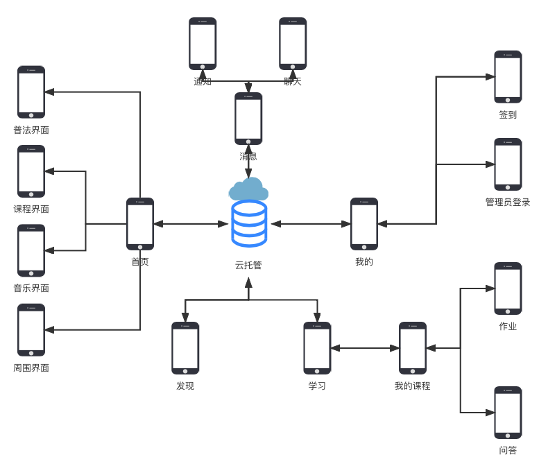

#### 2、识别子系统

本项目中实现了村民模块、管理人员模块，不同模块之间可以独立查看、配置或交付，在接口不变时可以独立开发，可以在不破坏系统其他部分的情况下独立地进行更改。

#### 3、开发和部署环境

1. 项目成员协作开发与版本管理工具选用GitLab
2. 开发工具选用微信开发者(稳定版)，采用云托管，使用Springboot进行搭建，数据库为MYSQL5.7版本。采用了一系列微信小程序开发组件库。
3. 操作系统支持:微信小程序可在多个平台运行，如iOS或者Android

#### 4、算法和数据结构

#### 5、持久性数据存储

项目中使用云托管搭建的云数据库进行数据的持久存储，而不在本地数据库中进行储存，云数据库为JSON 数据库，无需自建数据库，支持在小程序前端和云函数中调用，可以存储任意数量和形式的非结构化数据，并在控制台进行可视化管理。

#### 6、用户界面规范

- 统一性：
  - 默认字体大小：30rpx
  - 默认字体颜色：黑色
  - 主题色：#9cc6a2
  - 页面底色：白色或#fafafa
  - 图标色调保持一致
- 易用性：按钮通俗易懂并配有文字说明，与同一界面上其他按钮易于区分。完成同一功能或任务的元素放在集中位置，减少手指移动的距离。
- 规范性：界面符合常规小程序通用样式。

### 五、产品实现

#### 1、小程序说明

- 首页：包括普法、课程、音乐、周围等的按钮，以及今日资讯推送

  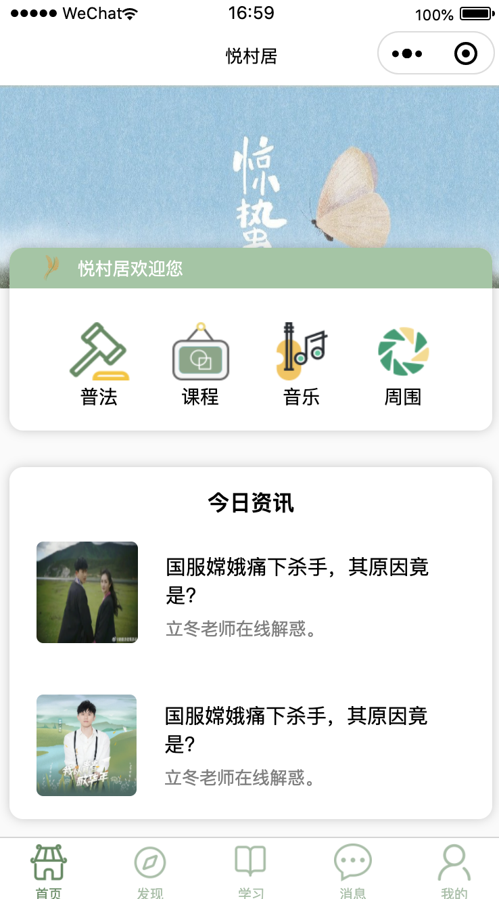

- 普法：显示有关法律法规介绍的图文推送，点击可跳转到详细的图文介绍页面

    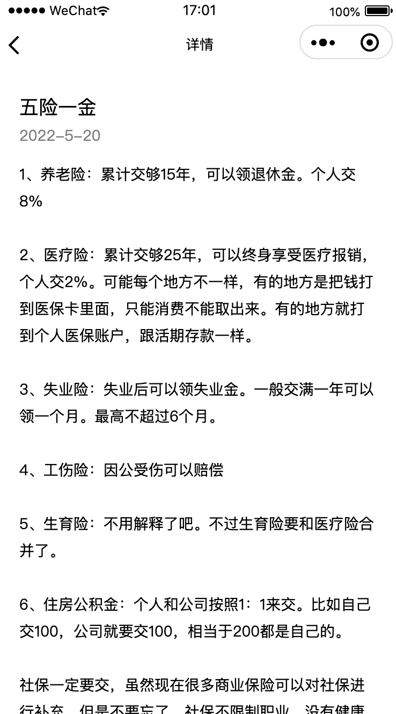

- 课程：分类展示类别的所有课程，在课程详情页显示课程主讲教师、课程介绍、课程评价，并且点击“立即参加”按钮可以订阅课程

  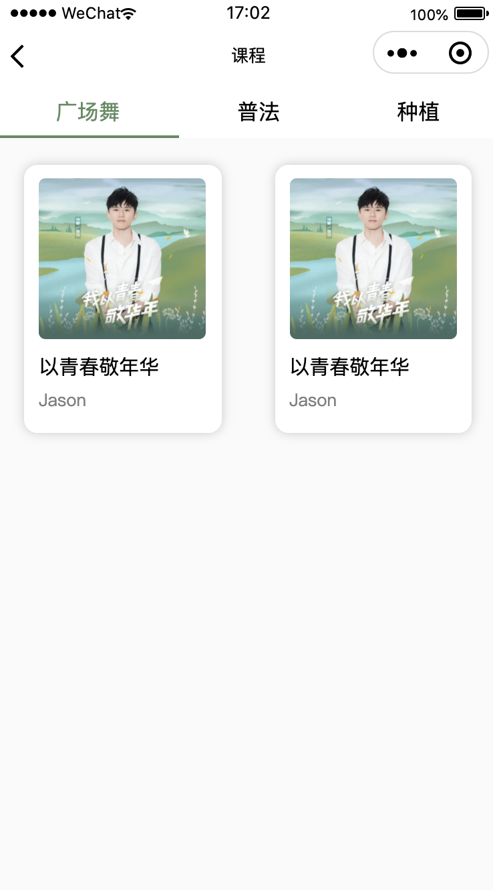  

- 音乐：显示用户上传的音乐，分为音乐推荐、播放器、播放列表等三个板块，音乐推荐显示热门音乐，播放器显示正在播放的音乐进度，播放列表显示用户正在播放的歌单

  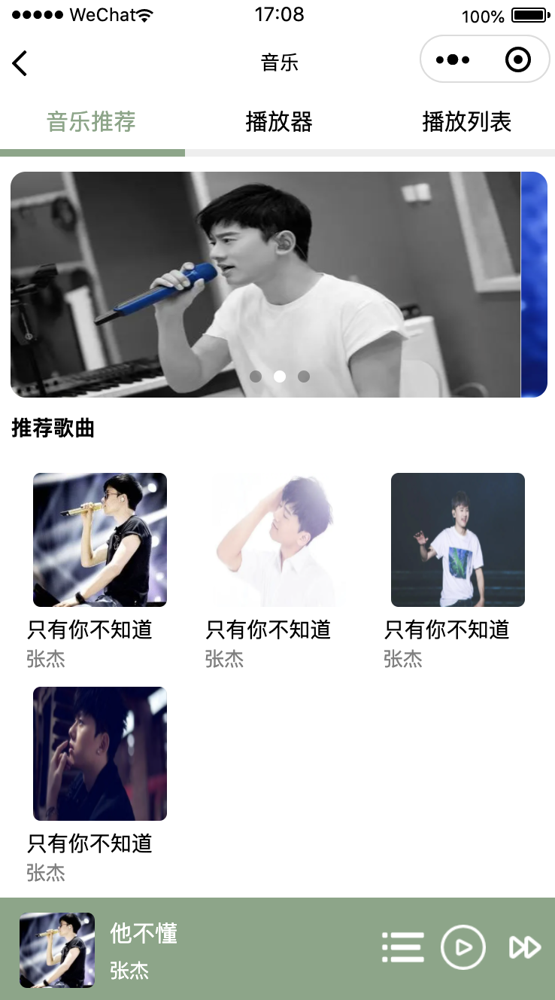  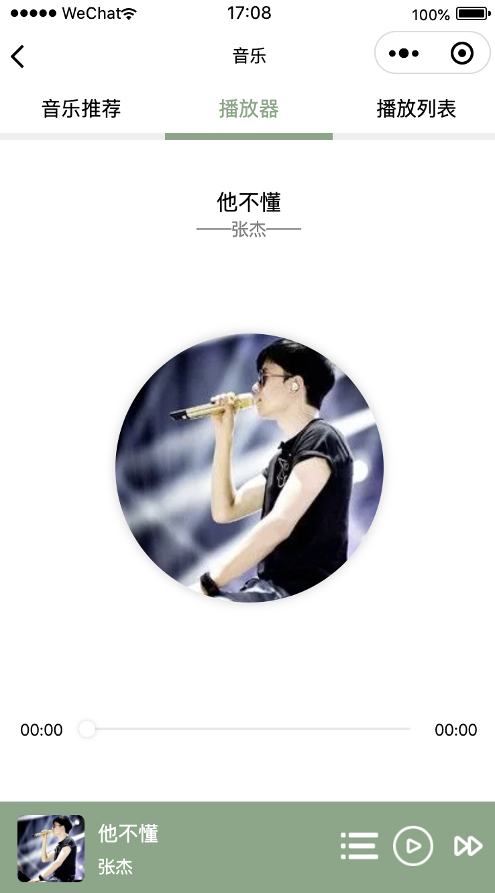  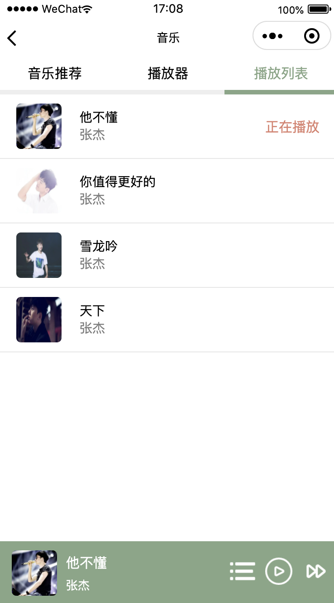

- 周围：显示用户上传的生活记录等的图文信息，点击浮动的按钮可上传自己的生活记录图文

  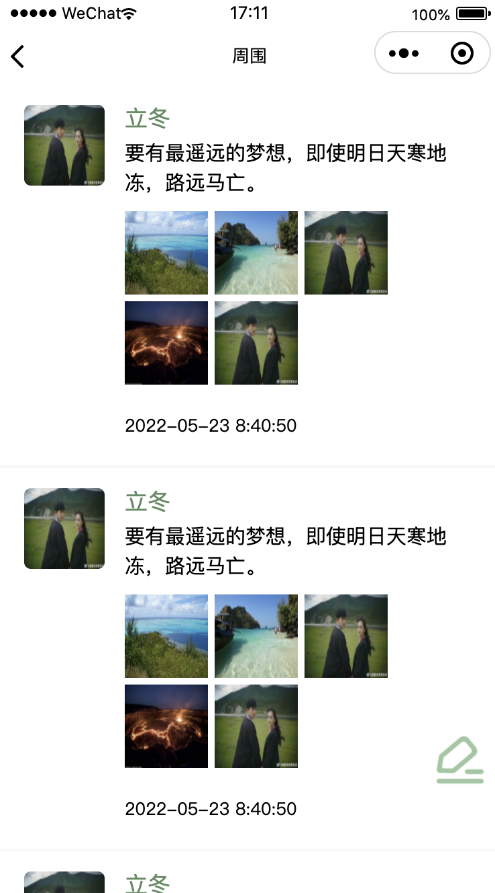    

- 今日资讯：显示用户最新上传的图文信息，点击咨询按钮可以查看详情

     

- ==发现==：显示用户上传的视频及视频介绍，通过上下滑动切换视频，支持用户点赞

  

- 学习：

  - 我的课程：显示当前用户已订阅的课程，点击课程名称可跳转至课程详情页，显示课程的简单介绍和课程资料。点击作业按钮可跳转至作业列表页并可查看作业详情，点击浮动按钮可上传作业。点击问答按钮可跳转至课程相关用户的问题与答复页面（暂未实现）

    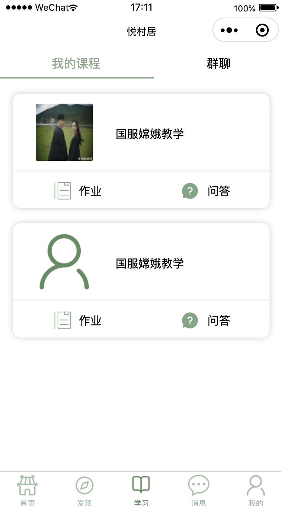        

  - 群聊：显示不同课程对应的群聊，点击群聊可跳转至聊天界面（暂未实现）

    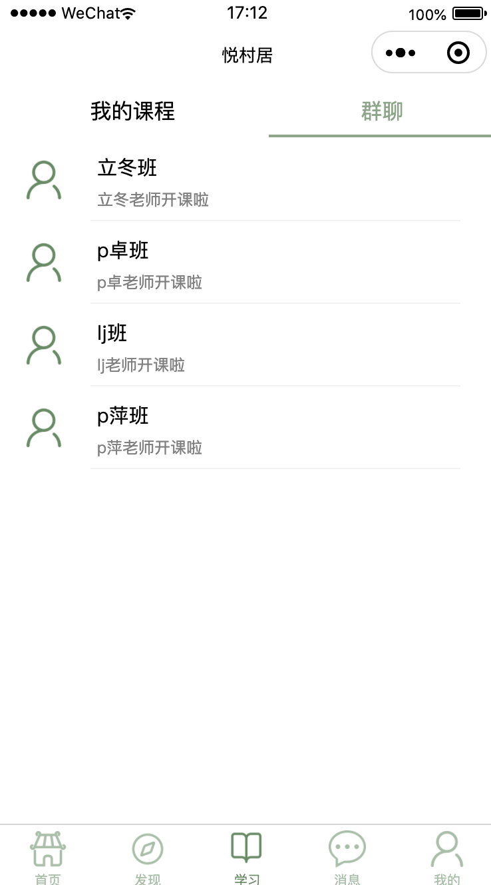

- 消息：

  - 通知：显示订阅的课程发布的通知，如新作业等
  - 聊天：用户与用户间的聊天列表，点击可跳转至聊天界面（暂未实现）

  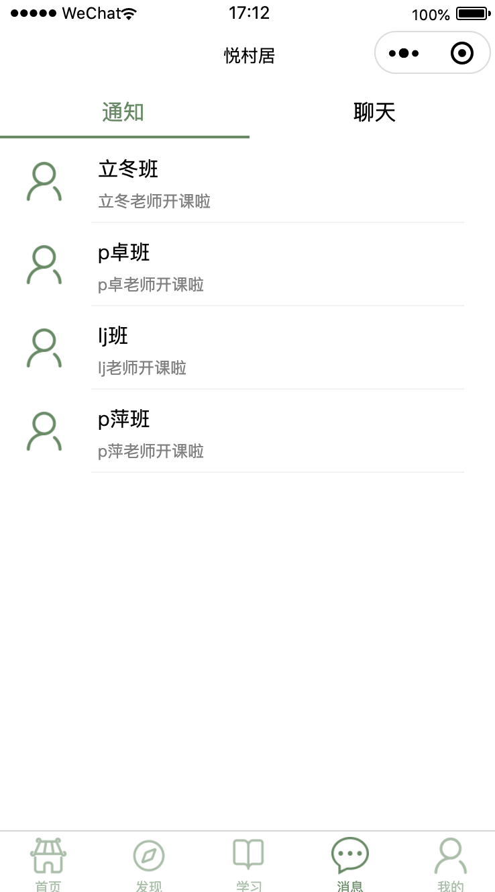

- 我的：

  - 显示用户昵称、头像等信息，支持用户签到、登录、退出登录等。
  
    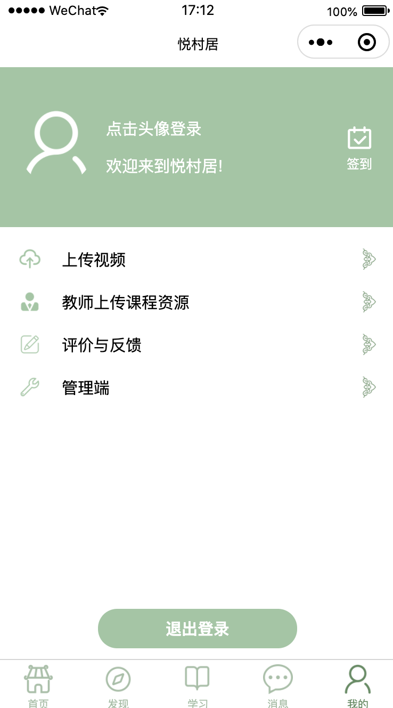
  
  - 支持用户提出评价与反馈（点击评价与反馈条目）
  
    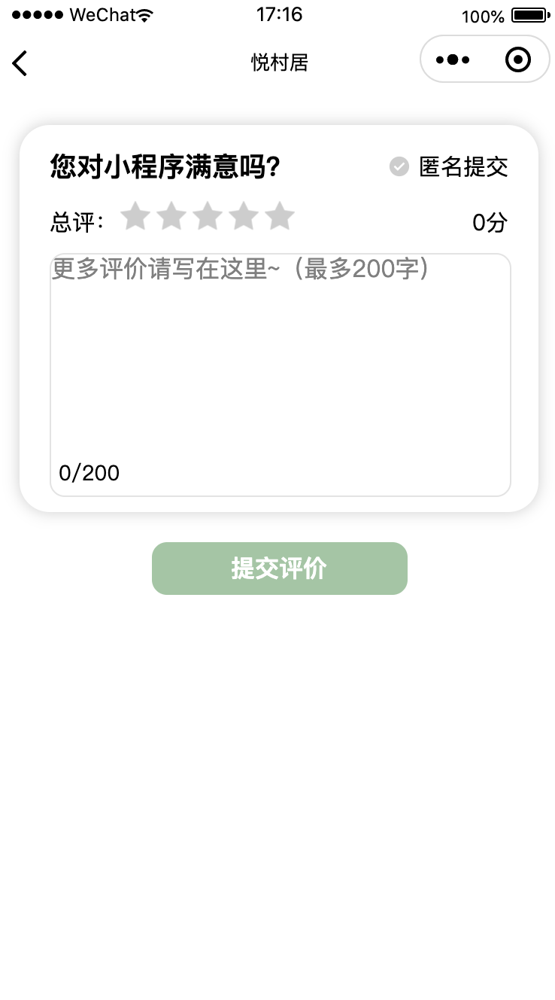
  
  - 支持用户上传视频（点击上传视频条目）
  
    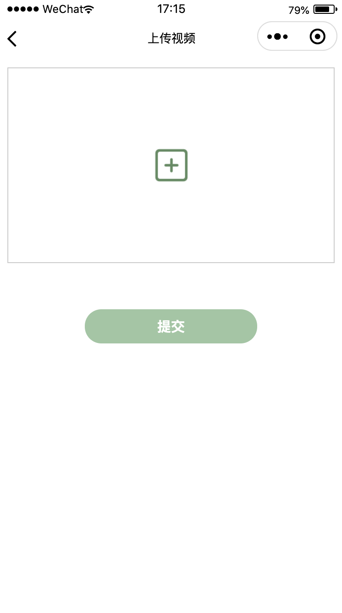
  
  - 支持教师上传课程资源（点击教师上传课程资源条目）
  
    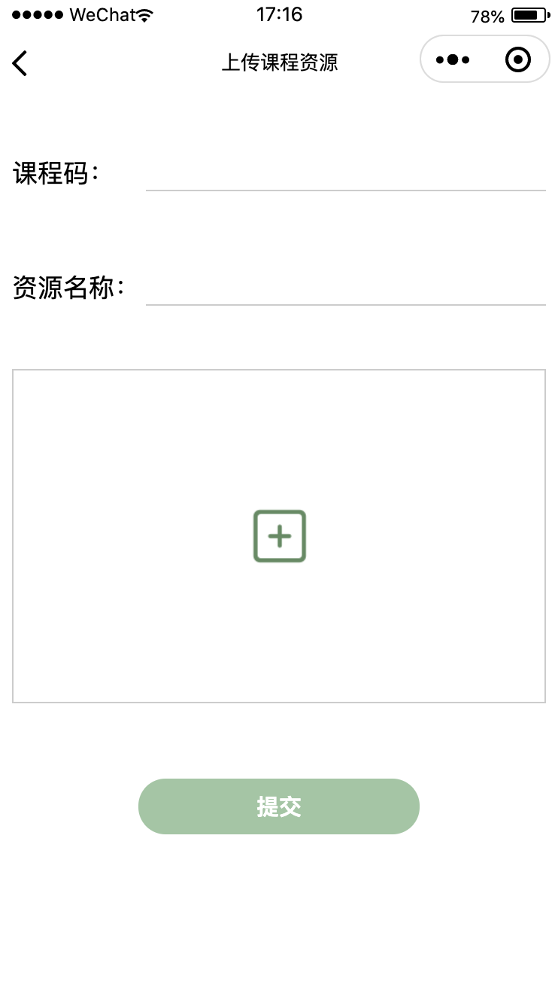
  
  - 支持管理人员登录管理端（点击管理端条目），输入管理人员的账号密码进行登录，登录成功后进入管理端界面。管理端界面点击上传按钮可进入上传资讯界面。
  
    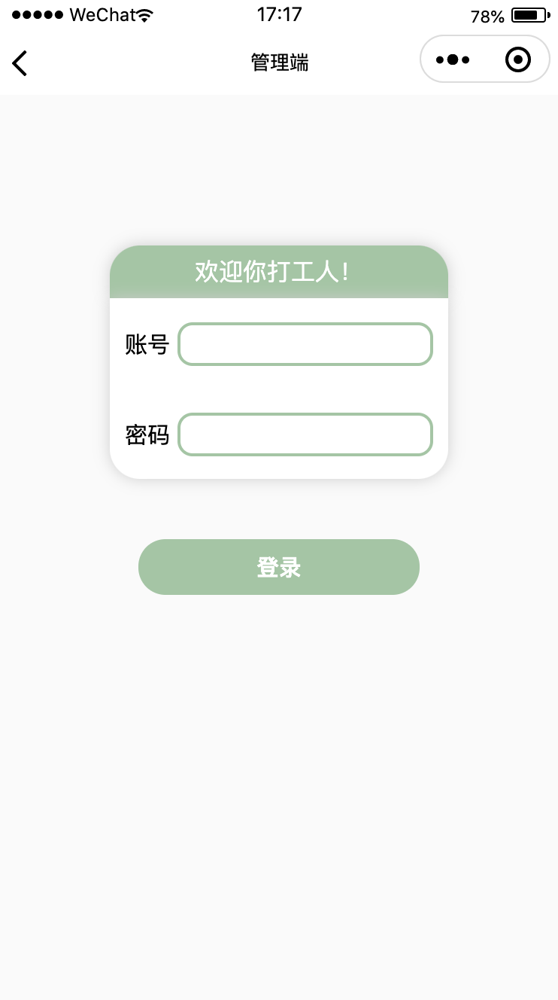  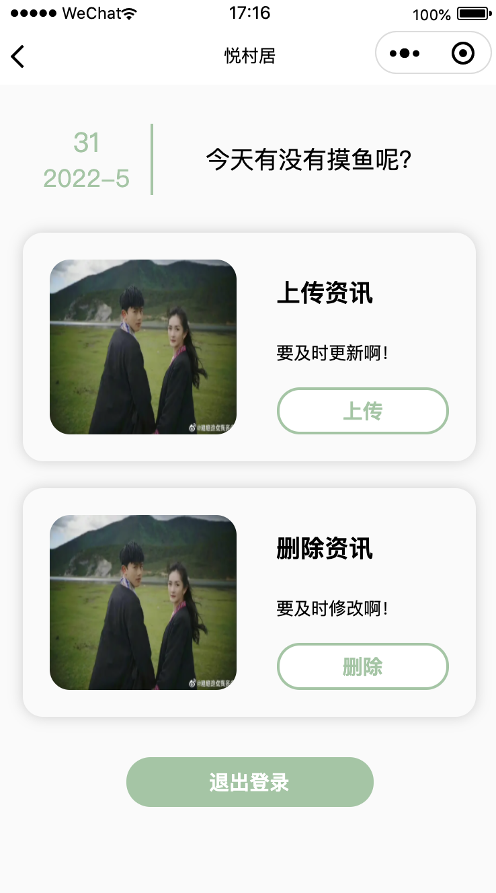  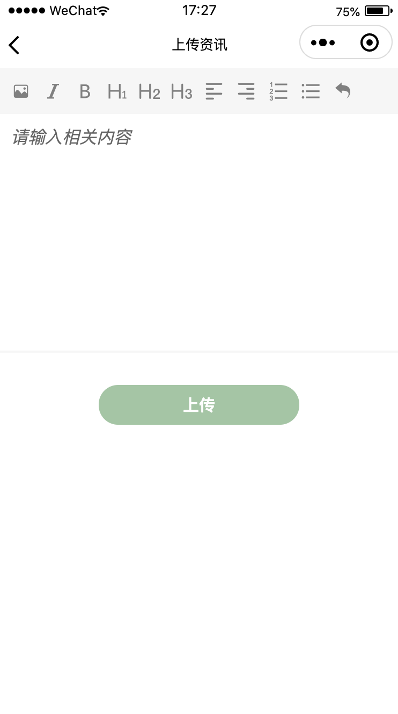

#### 2、应用场景

- 用户通过普法页面获取法律法规的相关信息。
- 用户通过课程页面订阅需要的课程，并在学习页面的我的课程查看课程相关作业、问答以及群聊与课程成员沟通。
- 用户通过发现页面查看视频并点赞。
- 用户通过音乐页面收听喜爱的歌曲。
- 用户通过周围页面浏览他人的生活分享等图文信息。
- 用户通过首页的今日资讯获取最新消息。
- 用户通过消息页面查看通知，并与他人进行交流。
- 用户通过我的页面登录、签到、退出登录。

### 六、产品访问链接和测试方法

> 老师与两位助教均已成为体验成员，微信扫描二维码即可使用

