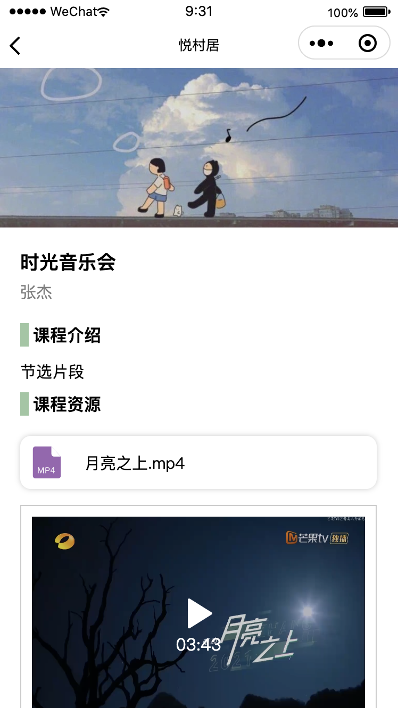
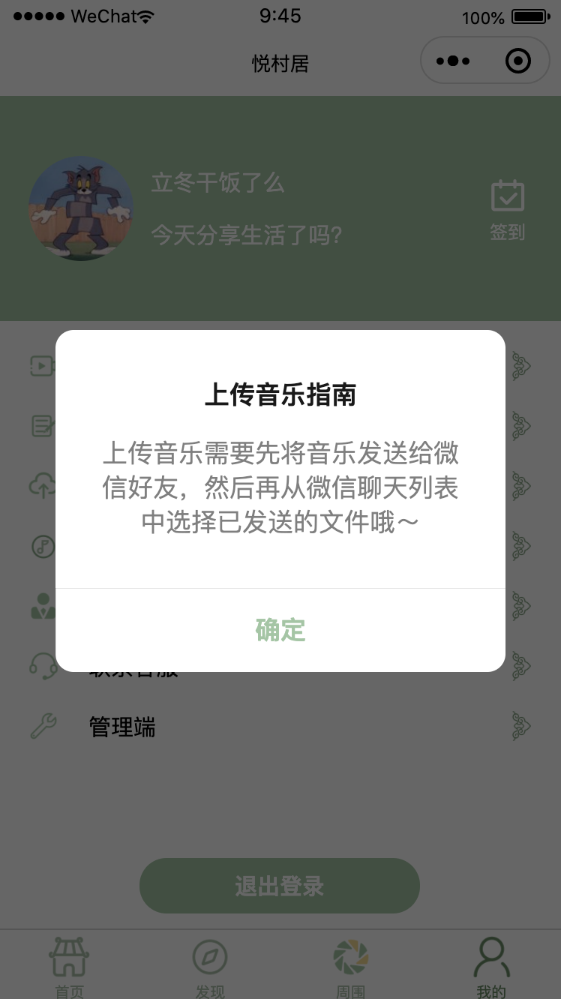

## 悦村居

> - appid：wx21d38ae68a0f69e0
> - 项目仓库地址：
>   - 小程序仓库地址：https://gitlab.com/ljqdx666/countryside.git
>   - 后端仓库地址：https://github.com/ljqdx666/mini-countryside.git
>
> - 团队成员：
>
>   - 南开大学软件学院软件工程专业2019级本科生栾佳琪
>
>   - 南开大学软件学院软件工程专业2019级本科生张思敏

### 一、项目说明

#### 1、主题陈述

乡村文化建设是振兴乡村的重要之举，如今，村民们参与文化活动的意识和观念也渐渐发生了变化，广场舞、视频分享生活等方式丰富着他们的业余生活。本项目致力于传播乡村传统文化、广场舞、书法等，并帮助村民们互动起来。此外，本项目提供普法、农技知识等课程，并支持线上教学以帮助村民们更好地学习生活技能、提高生活水平。

### 二、系统需求

#### 1、功能性需求

1. 村民：
   - 可以账号登录、注销；可以签到；
   - 可以浏览最新资讯；
   - 可以查看有关法律法规的图文信息；
   - 可以通过关键字搜索法律法规的图文信息；
   - 可以上传音乐；
   - 可以查看并收听已上传的歌曲；
   - 可以通过搜索歌名或歌手获取相关音乐；
   - 可以浏览所有人已上传的关于记录生活的图文信息；
   - 可以上传自己的关于记录生活的图文信息；
   - 可以查看自己已上传的所有关于记录生活的图文信息，并且支持删除；
   - 可以观看村民们已上传的有关生活等的视频，并且可以为喜欢的视频点赞；
   - 可以上传自己的有关生活等的视频；
   - 可以查看自己已上传的所有视频，并且支持删除；
   - 可以查看不同类别的所有课程；
   - 可以查看课程的详细内容，包括课程简介、视频资源等，并可以在线查看课程视频资源；
   - 可以申请开通课程，并上传课程的相关资源；
   - 可以联系客服；
2. 管理人员：
   - 可以登录、注销；
   - 可以上传资讯的图文信息；
   - 可以删除资讯；
   - 可以删除用户上传的音乐；
   - 可以删除用户上传的视频；
   - 可以审核用户申请的课程；

#### 2、非功能性性需求

1. 安全性：云数据库上的数据每周备份一次，保留备份记录，备份数据在其他设备上存储。  
2. 灵活性：可根据用户和市场的需求，不断升级更新。 
3. 可维护性：具备改正性维护、适应性维护、扩充与完善性维护等。 
4. 可靠性：存储的数据不会轻易丢失，系统不会因为正常的用户访问流量过大而导致瘫痪。 
5. 可测试性：在微信开发者工具中，允许对不同设备进行测试调配，允许对软件系统的不同功能进行测试调配。 
6. 易用性：所有类型的人员无需经过复杂的专业培训，小程序使用方便，上手操作快捷。

### 三、功能需求规范

#### 1、利益相关者

1. 村民
2. 管理人员

#### 2、行动者和目标

1. 行动者1:村民

   目标：

   1. 能够账号登录、注销；可以签到；
   2. 能够浏览最新资讯；
   3. 能够查看有关法律法规的图文信息；
   4. 能够上传音乐；
   5. 能够查看并收听已上传的歌曲；
   6. 能够通过搜索歌名或歌手获取相关音乐；
   7. 能够浏览所有人已上传的关于记录生活的图文信息；
   8. 能够上传自己的关于记录生活的图文信息；
   9. 能够查看自己已上传的所有关于记录生活的图文信息，并且支持删除；
   10. 能够观看村民们已上传的有关生活等的视频，并且可以为喜欢的视频点赞；
   11. 能够上传自己的有关生活等的视频；
   12. 能够查看自己已上传的所有视频；
   13. 能够查看不同类别的所有课程；
   14. 能够查看课程的详细内容，包括课程简介、视频资源等，并可以在线查看课程视频资源；
   15. 能够申请开通课程，并上传课程的相关资源；
   16. 能够联系客服；

2. 行动者2:管理人员

   目标：

   1. 能够通过账号密码登录管理端界面，用于权限限制
   2. 能够更新最新资讯的图文信息，包括增加和删除。
   3. 能够删除用户上传的音乐，用于审核管理；
   4. 能够删除用户上传的视频，用于审核管理；
   5. 可以审核用户申请的课程；

#### 3、用例和描述

1. ##### 村民

   

2. 管理人员

   

### 四、系统架构设计与实现

#### 1、架构样式

以数据为中心的体系结构，不同的页面间独立运行，数据库的增删改查可以在多个页面实现，在更改现有页面或增加新页面时，不会影响其他页面，促进了可集成性。


#### 2、时序图


#### 3、识别子系统

本项目中实现了村民模块、管理人员模块，不同模块之间可以独立查看、配置或交付，在接口不变时可以独立开发，可以在不破坏系统其他部分的情况下独立地进行更改。

#### 4、开发和部署环境

1. 项目成员协作开发与版本管理工具选用GitLab
2. 开发工具选用微信开发者(稳定版)，采用云托管，使用Springboot进行搭建，数据库为MYSQL5.7版本。采用了一系列微信小程序开发组件库。
3. 操作系统支持:微信小程序可在多个平台运行，如iOS或者Android

#### 5、算法和数据结构

##### 1、数据库设计与实现

本项目开发中的数据库采用`InnoDB`引擎，字符集采用`utf8mb4`，排序规则采用`utf8mb4_bin`。

数据库的版本管理使用`Flyway`工具，在项目运行时自动执行项目目录`\src\main\resources\db\migration`下的sql文件，无需手动就可以实现数据库的创建和更改。

由于flyway工具是根据sql文件名称中字母`V`后数字大小顺序执行。所以执行的sql文件名称由写好的脚本（项目目录下`bin/migration.sh`）根据`时间戳+输入的名称`运行产生，方便集成，也省去了自己控制flyway执行顺序的过程。

以下为项目中各个数据库的设计：


- flyway_schema_history表

  该表为flyway工具自动生成的表，用于存储执行过的sql文件信息，确保每个sql文件只执行一次。

  ```sql
  DROP TABLE IF EXISTS `flyway_schema_history`;
  CREATE TABLE `flyway_schema_history` 
  	(
          `installed_rank` int NOT NULL,
          `version` varchar(50) CHARACTER SET utf8mb4 COLLATE utf8mb4_bin NULL DEFAULT NULL,
          `description` varchar(200) CHARACTER SET utf8mb4 COLLATE utf8mb4_bin NOT NULL,
          `type` varchar(20) CHARACTER SET utf8mb4 COLLATE utf8mb4_bin NOT NULL,
          `script` varchar(1000) CHARACTER SET utf8mb4 COLLATE utf8mb4_bin NOT NULL,
          `checksum` int NULL DEFAULT NULL,
          `installed_by` varchar(100) CHARACTER SET utf8mb4 COLLATE utf8mb4_bin NOT NULL,
          `installed_on` timestamp NOT NULL DEFAULT CURRENT_TIMESTAMP,
          `execution_time` int NOT NULL,
          `success` tinyint(1) NOT NULL,
          PRIMARY KEY (`installed_rank`) USING BTREE,
          INDEX `flyway_schema_history_s_idx`(`success` ASC) USING BTREE
  	) ENGINE = InnoDB CHARACTER SET = utf8mb4 COLLATE = utf8mb4_bin ROW_FORMAT = Dynamic;
  ```

- user表

  该表为管理端用户表，存储管理端账户信息。

  ```sql
  DROP TABLE IF EXISTS `user`;
  CREATE TABLE `user`  
  	(
          `username` varchar(64) CHARACTER SET utf8mb4 COLLATE utf8mb4_bin NOT NULL COMMENT '用户账号',
          `password` varchar(64) CHARACTER SET utf8mb4 COLLATE utf8mb4_bin NOT NULL COMMENT '用户密码',
          PRIMARY KEY (`username`) USING BTREE,
          INDEX `username`(`username` ASC) USING BTREE
  	) ENGINE = InnoDB CHARACTER SET = utf8mb4 COLLATE = utf8mb4_bin COMMENT = '用户表' ROW_FORMAT = Dynamic;
  ```

- news表

  该表为资讯表，用于存储资讯信息（即小程序中“普法”模块的资讯信息）。

  ```sql
  DROP TABLE IF EXISTS `news`;
  CREATE TABLE `news`  
  	(
          `id` varchar(32) CHARACTER SET utf8mb4 COLLATE utf8mb4_bin NOT NULL COMMENT '资讯id',
          `title` varchar(64) CHARACTER SET utf8mb4 COLLATE utf8mb4_bin NOT NULL COMMENT '资讯标题',
          `key_words` varchar(64) CHARACTER SET utf8mb4 COLLATE utf8mb4_bin NULL DEFAULT NULL COMMENT '资讯概要',
          `pic_url` varchar(255) CHARACTER SET utf8mb4 COLLATE utf8mb4_bin NOT NULL COMMENT '图片链接',
          `content` varchar(2048) CHARACTER SET utf8mb4 COLLATE utf8mb4_bin NOT NULL COMMENT '资讯内容',
          `creator_name` varchar(64) CHARACTER SET utf8mb4 COLLATE utf8mb4_bin NOT NULL COMMENT '发布人账号名称',
          `created_time` datetime(6) NOT NULL ON UPDATE CURRENT_TIMESTAMP(6) COMMENT '创建时间',
          `updated_time` datetime(6) NOT NULL ON UPDATE CURRENT_TIMESTAMP(6) COMMENT '更新时间',
          PRIMARY KEY (`id`) USING BTREE,
          INDEX `c_cloud_id`(`creator_name` ASC) USING BTREE
  	) ENGINE = InnoDB CHARACTER SET = utf8mb4 COLLATE = utf8mb4_bin COMMENT = '资讯表' ROW_FORMAT = DYNAMIC;
  ```

- video表

  该表为小视频表，存储小视频信息（即小程序中“发现”模块中的小视频）。

  ```sql
  DROP TABLE IF EXISTS `video`;
  CREATE TABLE `video`  
  	(
          `id` varchar(32) CHARACTER SET utf8mb4 COLLATE utf8mb4_bin NOT NULL COMMENT '视频id',
          `creator_name` varchar(64) CHARACTER SET utf8mb4 COLLATE utf8mb4_bin NOT NULL COMMENT '上传者昵称',
          `creator_pic_url` varchar(255) CHARACTER SET utf8mb4 COLLATE utf8mb4_bin NOT NULL COMMENT '上传者头像链接',
          `title` varchar(255) CHARACTER SET utf8mb4 COLLATE utf8mb4_bin NULL DEFAULT NULL COMMENT '标题',
          `video_url` varchar(255) CHARACTER SET utf8mb4 COLLATE utf8mb4_bin NOT NULL COMMENT '视频链接',
          `like_num` int UNSIGNED NOT NULL DEFAULT 0 COMMENT '点赞数',
          `created_time` datetime(6) NOT NULL ON UPDATE CURRENT_TIMESTAMP(6) COMMENT '上传时间',
          `updated_time` datetime(6) NOT NULL ON UPDATE CURRENT_TIMESTAMP(6) COMMENT '更新时间',
          PRIMARY KEY (`id`) USING BTREE
  	) ENGINE = InnoDB CHARACTER SET = utf8mb4 COLLATE = utf8mb4_bin ROW_FORMAT = DYNAMIC;
  ```

- song表

  该表为音乐表，存储音乐信息（即小程序中“音乐”模块中的音乐）。

  ```sql
  DROP TABLE IF EXISTS `song`;
  CREATE TABLE `song`  
  	(
          `id` varchar(32) CHARACTER SET utf8mb4 COLLATE utf8mb4_bin NOT NULL COMMENT '音乐id',
          `song_name` varchar(32) CHARACTER SET utf8mb4 COLLATE utf8mb4_bin NOT NULL COMMENT '歌曲名称',`singer_name` varchar(32) CHARACTER SET utf8mb4 COLLATE utf8mb4_bin NOT NULL COMMENT '歌手姓名',
          `song_url` varchar(255) CHARACTER SET utf8mb4 COLLATE utf8mb4_bin NOT NULL COMMENT '歌曲文件链接',
          `song_pic_url` varchar(255) CHARACTER SET utf8mb4 COLLATE utf8mb4_bin NOT NULL COMMENT '歌曲图片链接',
          `created_time` datetime(6) NOT NULL ON UPDATE CURRENT_TIMESTAMP(6) COMMENT '创建时间',
          `updated_time` datetime(6) NOT NULL ON UPDATE CURRENT_TIMESTAMP(6) COMMENT '更新时间',
          PRIMARY KEY (`id`) USING BTREE
  	) ENGINE = InnoDB CHARACTER SET = utf8mb4 COLLATE = utf8mb4_bin ROW_FORMAT = Dynamic;
  ```

- lesson表

  该表为课程表，储存课程的基本信息（即小程序中“课程”板块的基本信息）。

  ```sql
  DROP TABLE IF EXISTS `lesson`;
  CREATE TABLE `lesson`  
  	(
          `id` varchar(32) CHARACTER SET utf8mb4 COLLATE utf8mb4_bin NOT NULL COMMENT '课程id',
          `title` varchar(64) CHARACTER SET utf8mb4 COLLATE utf8mb4_bin NOT NULL COMMENT '课程名称',                         
          `classification` varchar(32) CHARACTER SET utf8mb4 COLLATE utf8mb4_bin NOT NULL COMMENT '课程分类',                           
          `teacher_name` varchar(64) CHARACTER SET utf8mb4 COLLATE utf8mb4_bin NOT NULL COMMENT '主讲人名称',                           
          `key_words` varchar(255) CHARACTER SET utf8mb4 COLLATE utf8mb4_bin NULL DEFAULT NULL COMMENT '课程介绍',                       
          `pic_url` varchar(255) CHARACTER SET utf8mb4 COLLATE utf8mb4_bin NOT NULL COMMENT '课程封面图片链接',
          `checked` tinyint(1) NOT NULL DEFAULT 0 COMMENT '是否审核通过，1-是，2-否',
          `created_time` datetime(6) NOT NULL ON UPDATE CURRENT_TIMESTAMP(6) COMMENT '上传时间',
          `updated_time` datetime(6) NOT NULL ON UPDATE CURRENT_TIMESTAMP(6) COMMENT '更新时间',
          PRIMARY KEY (`id`) USING BTREE
  	) ENGINE = InnoDB CHARACTER SET = utf8mb4 COLLATE = utf8mb4_bin ROW_FORMAT = DYNAMIC;
  ```

- surrounding表

  该表为周围表，储存周围的基本信息（即小程序中“周围”模块的基本信息）。

  ```sql
  DROP TABLE IF EXISTS `surrounding`;
  CREATE TABLE `surrounding`  
  	(
          `id` varchar(32) CHARACTER SET utf8mb4 COLLATE utf8mb4_bin NOT NULL COMMENT '周围id',                               
          `creator_name` varchar(64) CHARACTER SET utf8mb4 COLLATE utf8mb4_bin NOT NULL COMMENT '上传者昵称',                           
          `creator_pic_url` varchar(255) CHARACTER SET utf8mb4 COLLATE utf8mb4_bin NOT NULL COMMENT '上传者头像链接',                   
          `title` varchar(255) CHARACTER SET utf8mb4 COLLATE utf8mb4_bin NOT NULL COMMENT '标题',                            
          `created_time` datetime(6) NOT NULL ON UPDATE CURRENT_TIMESTAMP(6) COMMENT '上传时间',                           
          `updated_time` datetime(6) NOT NULL ON UPDATE CURRENT_TIMESTAMP(6) COMMENT '更新时间',                           
          PRIMARY KEY (`id`) USING BTREE
  	) ENGINE = InnoDB CHARACTER SET = utf8mb4 COLLATE = utf8mb4_bin ROW_FORMAT = Dynamic;
  ```

- content表

  该表为内容表，储存课程和周边中的文件信息。

  ```sql
  DROP TABLE IF EXISTS `content`;
  CREATE TABLE `content`  
  	(  
          `id` varchar(36) CHARACTER SET utf8mb4 COLLATE utf8mb4_bin NOT NULL COMMENT '内容id',  
          `lesson_id` varchar(36) CHARACTER SET utf8mb4 COLLATE utf8mb4_bin NOT NULL COMMENT '所属课程或周边id',  
          `content_url` varchar(255) CHARACTER SET utf8mb4 COLLATE utf8mb4_bin NOT NULL COMMENT '内容链接', 
          `created_time` datetime(6) NOT NULL ON UPDATE CURRENT_TIMESTAMP(6) COMMENT '创建时间',  
          `updated_time` datetime(6) NOT NULL ON UPDATE CURRENT_TIMESTAMP(6) COMMENT '更新时间',  
          PRIMARY KEY (`id`) USING BTREE
  	) ENGINE = InnoDB CHARACTER SET = utf8mb4 COLLATE = utf8mb4_bin ROW_FORMAT = DYNAMIC;
  ```

##### 2、后端服务层次设计与实现要点

服务与部署项目代码目录

```
├─.idea
│  ├─dataSources
│  ├─inspectionProfiles
│  └─libraries
├─.mvn
│  └─wrapper
├─bin------------------------------储存自动生成sql文件的脚本文件migration.sh
├─src
│  ├─main
│  │  ├─java
│  │  │  └─com
│  │  │      └─miniapp
│  │  │          └─countryside-----主要代码文件
│  │  │              ├─controller
│  │  │              ├─dto
│  │  │              ├─entity
│  │  │              ├─exception
│  │  │              ├─handler
│  │  │              ├─mapper
│  │  │              ├─repository
│  │  │              ├─service
│  │  │              │  └─impl
│  │  │              ├─utils
│  │  │              └─vo
│  │  └─resources
│  │      └─db
│  │          └─migration
│  └─test
│      ├─java
│      │  └─com
│      │      └─miniapp
│      │          └─countryside
│      └─resources
└─target
  ├─classes
  ├─generated-sources
  ├─generated-test-sources
  └─test-classes
```

###### （1） 后端服务的层次设计

- entity层：数据层。维护持久层类，用于直接调取数据库

- vo层：数据层。作为服务接口的返回值

- dto层：数据层。作为前端调用接口时传输参数的储存与传输，并承担数据校验工作。

- controller层：接口层。定义服务的接口，调用service层方法，控制数据的传入与传出，输出为Vo层对象。

- service层：方法层。定义传入数据和数据库的处理方法，输入和输出数据均为Dto层对象。

- repository层：数据库方法层。定义数据库处理的方法，输出为Entity层对象。

- mapper层：对象转换层。定义对象转换的接口。

- exception层：异常类定义层。自定义异常类与异常类型。

- handler层：处理层。本项目实现了全局的异常捕捉与处理。定义了项目中可能遇到的异常类型（`RuntimeException`、`MethodArgumentNotValidException`、`AccessDeniedException`）的处理过程。

- utils层：工具层。本项目实现了数据库主键id的生成器。

  所以，数据的传输和处理过程如下图所示：

  

###### (2) 实现要点：

- Mapper层中运用MapStruct，实现Entity层、Dto层、Vo层对象间的相互转换。
- Entity层、Dto层、Vo层中使用`@Data`注解，自动生成setter和getter方法。
- controller层运用`@RequestBody`注解，实现把传输的json数据向对象映射的过程。
- dto层运用了Validate，实现传入数据的简单校验和报错
- handler层运用了`@ExceptionHandler`注解，实现全局异常的捕捉与处理
- utils层使用`Ksuid`工具，实现了主键字段id的生成器。
- repository层继承了`JpaRepository`类，具有很多现成的函数，方便对数据库进行处理。

#### 6、持久性数据存储

项目中使用云托管搭建的云数据库进行数据的持久存储，而不在本地数据库中进行储存，云数据库为JSON 数据库，无需自建数据库，支持在小程序前端和云函数中调用，可以存储任意数量和形式的非结构化数据，并在控制台进行可视化管理。

#### 7、用户界面规范

- 统一性：
  - 默认字体大小：30rpx
  - 默认字体颜色：黑色
  - 主题色：#9cc6a2
  - 页面底色：白色或#fafafa
  - 图标色调保持一致
- 易用性：按钮通俗易懂并配有文字说明，与同一界面上其他按钮易于区分。完成同一功能或任务的元素放在集中位置，减少手指移动的距离。
- 规范性：界面符合常规小程序通用样式。

### 五、产品实现

#### 1、小程序说明

- 首页：包括普法、课程、音乐、周围等的按钮，以及今日资讯推送

  

- 普法：显示有关法律法规介绍的图文推送，点击可跳转到详细的图文介绍页面。支持关键字搜索相关条目。

    

- 课程：分类展示类别的所有课程，在课程详情页显示课程主讲教师、课程介绍、课程资源，并且可以在线观看

    

- 音乐：显示用户上传的音乐，分为音乐推荐、播放器、播放列表等三个板块，音乐推荐显示热门音乐，并可通过搜索歌名或歌手的关键字获取相关音乐列表；播放器显示正在播放的音乐进度；播放列表显示用户正在播放的歌单

      

- 今日资讯：显示用户最新上传的图文信息，点击咨询按钮可以查看详情

    

- ==发现==：显示用户上传的视频、上传者信息和视频介绍，通过上下滑动切换视频，支持用户点赞

  

- 周围：显示用户上传的生活记录等的图文信息，点击浮动的按钮可上传自己的生活记录图文，点击图片可查看详情

      

- 我的：

  - 显示用户昵称、头像等信息，支持用户签到、登录、退出登录等。
  
    
  
  - 支持用户查看自己已上传的全部视频：点击我的视频按钮，并支持删除视频
  
    
  
  - 支持用户查看自己已上传的生活记录图文信息：点击我的生活记录按钮，并支持删除图文信息，点击图片可查看详情
  
    
  
  - 支持用户上传视频：点击上传视频按钮
  
    
  
  - 支持用户上传音乐：点击上传音乐按钮，提供上传操作指南
  
      
  
  - 支持教师上传课程资源：点击教师开通课程按钮
  
    
  
  - 支持用户联系客服：点击联系客服按钮
  
  - 支持管理人员登录管理端（点击管理端按钮），输入管理人员的账号密码进行登录，登录成功后进入管理端界面。
  
      
    
    - 上传资讯
    
      
    
    - 删除资讯：可通过左滑删除资讯，并支持查看资讯详情后点击页面右侧的删除按钮进行删除
    
          
    
    - 删除音乐
    
      
    
    - 删除视频
    
      
    
    - 审核课程
    
      。

#### 2、应用场景

- 用户通过普法页面获取法律法规的相关信息。
- 用户通过课程页面选择需要的课程，并在课程详情页面查看课程资源。
- 用户通过发现页面查看视频并点赞。
- 用户通过音乐页面收听喜爱的歌曲。
- 用户通过周围页面浏览他人的生活分享等图文信息。
- 用户通过首页的今日资讯获取最新消息。
- 用户通过我的页面登录、签到、退出登录。

### 六、产品访问链接和测试方法

> 微信扫描二维码即可使用

